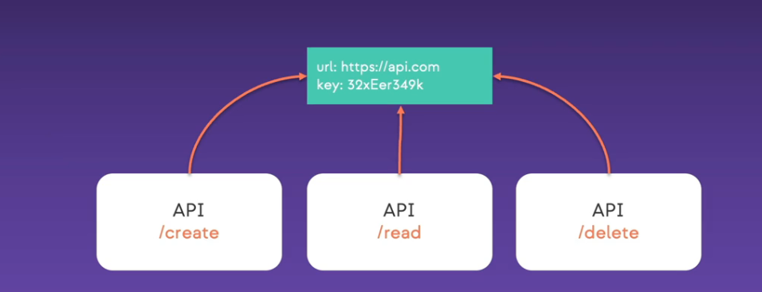
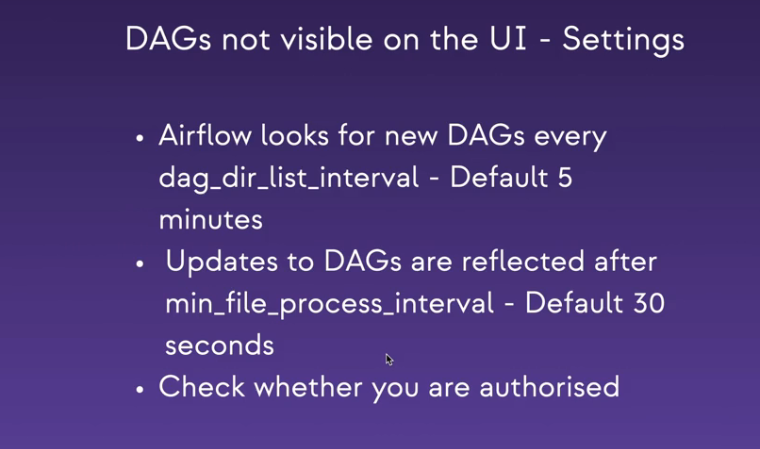
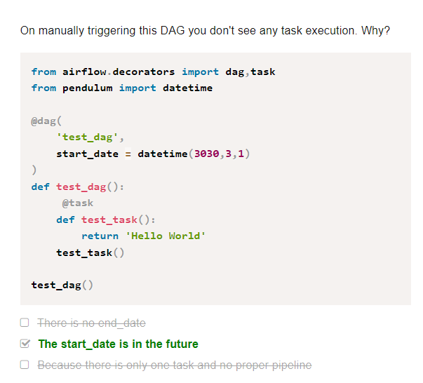
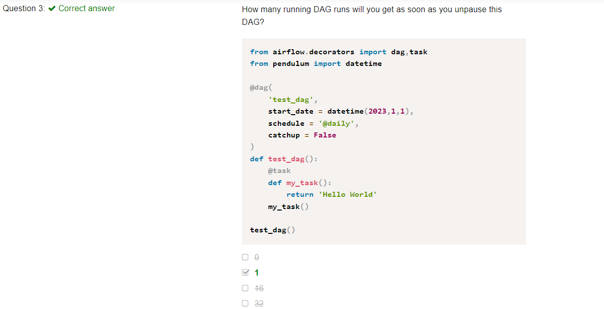

# Airflow with Astronomer Managed Cloud

Airflow Astronomer is a data orchestration tool that allows us to create data pipelines using python and integrate a variety of operators like Databricks, Snowflake and dbt.

Here are some notes I took while taking up a fantastic set of courses by Astronomer, a managed cloud service for Airflow.

There are a bunch of different Modules but here is the [learning path](https://academy.astronomer.io/path/airflow-101) that I followed.

## Module 1 - Intro to Astro CLI


### Setting Up and Running Astro CLI?

- Astro CLI uses docker to setup and run local dev environment.
- Two Commands to execute are:
    - ```dev init``` to init the local dev envt
    - ```dev start``` to spin up airflow instance


There are four docker images **Web Server**,**Scheduler**,**Database** and **Triggerer** that are part of a Docker Container called Astronomer Runtime.

### Pushing the DAG to the Production Envt


- A request is sent to the Airflow API saying that we need to update the airflow instance of a deployment, a docker image is created with our DAGs and pushed
into the registry.

- Then finally the Aiirflow instance in the data plane is restarted with the new docker instances with DAGs


### Installing Astro CLI

Docs : [Click Here](https://docs.astronomer.io/astro/cli/install-cli?tab=windowswithwinget#install-the-astro-cli)


## Module 2 - Airflow Concepts

### Creating a Project

- ```mkdir astro && cs astro```

- ```astro dev init```


- ```airflow_settings.yaml``` allows us to recrete a project without creating variables and connections over and over again.

### Running Airflow

- ```astro dev start``` spins up airflow and downloads the docker images for airflow components.


### Add additional providers in Airflow

- On astro terminal type ```astro dev run providers list``` to check the list of all the providers.

- if anything is not installed, pip install it from the providers page in the UI and add it to the reqs file.

### Upgrading Astro Runtime

Go to Dockerfile and change the version then run ```asto dev restart```

### Non Base Images v/s Base Image

By default we have the non base image where the folders and dependencies are auto copied to the docker container but if we want to have full control of everything
and add whatever folders we want, we have to use the base image.

We can switch to the base image by changing the command in Dockerfile to ```FROM quay.io/astronomer/astro-runtime:5.3.0-base```

### Persisting Variables after killing Airflow Image

Check how to do this [here](https://academy.astronomer.io/path/airflow-101/local-development-environment/1569583)

### Environment Variables

In the ```.env``` file we can specify the name of the environment as ```AIRFLOW__WEBSERVER__INSTANCE__NAME = ProdEnv```

If we want to keep mutiple environments just add one more file ```.dev``` and add ```ENVIRONMENT = dev``` in that file. 

Now we can start the server with this env, ```airflow dev start --env .dev```

This is only valid in our local environment.

If we want too export the environment variables to the Astro instance, then we need to add ```ENV AIFLOW__WEBSERVER__INSTANCE__NAME = ProdEnv``` to the Dockerfile.

### Checking DAGs for Errors before Running it

If we dodnt want to wait for 5-6 min for the UI to throw up any import or other errors then we can use ```astro dev parse``` to get all the possible errors in 
the command line itself.

We can also use the pytest library for testing using ```astro dev pytest```

Another way to run and compile dags in the cli is ```astro run```. This Trigger a single DAG run in a local Airflow environment and 
see task success or failure in your terminal. This command compiles your DAG and runs it in a single Airflow worker container based on your 
Astro project configurations.

More type of testing like backtesting dependencies during updates is [here](https://docs.astronomer.io/astro/cli/test-your-astro-project-locally)

### How Everything Works?

Step 1 : 


Step 2 : 


Scheduler processes the DAG and we may need to wait upto 5 min before getting the new DAG on the Airflow UI.

Step 3:

The scheduler creates the DAGRun Object that has the states running.

Step 4:


The scheduler then creates the task instance which is instance of the task at a certain time and it has the state scheduled.

Step 5:


Now the Task Instance is queued and the scheduler sends the taskInstance object to the executor that executes it and the state of the task is complete.


Now either the task status is success or failed and it updates the state accordingly.

Then the scheduler checks whether the work is done or not.


Finally the Airflow UI is updated.

Check the [video](https://academy.astronomer.io/path/airflow-101/astro-runtime-airflow-concepts/1273942) also.

## Module 3  : Airflow UI


Here the long vertical line is the DagRun Object and the short boxes are the Task Instances.

Landing time view illustrates how much time each task takes and we can check if optimizations applied are efficient or not.

### Gantt Charts

These charts show how much time it took to run the DAG. 

Grey color means that the DAG was queued and green means the DAG was running and completed.


In this image, the second DAG took the longest to run.

### Quiz Questions

Video : Monitor DAG Runs and Task Instances


Video: Overview Of DAG


So total number of successful DAGs are 4.

Same type of logic here as well. Upstream Failed is represented by the orange color.


### Debug and Rerun DAG

Go to this UI page by going to the link ```http://localhost:8080/dagrun/list/?_flt_3_dag_id=example_dag_basic```

Add filter equal to failed


Select the DAGs -> Click on Action -> Clear State to rerun the  DAGs


## Module 4 : Simple DAG

- Catchup : Catchup refers to the process of scheduling and executing all the past DAG runs that would have been scheduled if the DAG had been created and running at an earlier point in time.

### Create DAG with Traditional Paradigm

with is a context manager

```py
from airflow import DAG
from datetime import datetime

with DAG('my_dag', start_date=datetime(2023, 1 , 1),
         description='A simple tutorial DAG', tags=['data_science'],
         schedule='@daily', catchup=False):
```

### Using the TaskAPI

**@dag is a decorator**

```py
from airflow.decorators import dag
from datetime import datetime

@dag(start_date=datetime(2023, 1, 1), description='A simple tutorial DAG', 
     tags=['data_science'], schedule='@daily', catchup=False)
def my_dag():
    None

my_dag()
```

### Defining a Python Operator Task


### DAG without context manager with


Much simpler method with TaskFlowAPI

```py
from airflow.decorators import dag, task
from datetime import datetime

@dag(start_date=datetime(2023, 1, 1), description='A simple tutorial DAG', 
     tags=['data_science'], schedule='@daily', catchup=False)
def my_dag():
    
    @task
    def print_a():
        print('hi from task a')
```

### Chain Dependencies

First Import ```from airflow.util.helpers imoprt chain```

```task_a >> [task_b,task_c,task_d] >> task_e```


```chain(task_a,[task_b,task_c],[task_d,task_e])```


### Setting Default Args

```py
default_args = {
    'retries': 3,
}
```

### Dependencies with Task Flow API

```py
from airflow.decorators import dag, task
from datetime import datetime
from airflow.utils.helpers import chain


@dag(start_date=datetime(2023, 1 , 1),
         description='A simple tutorial DAG', tags=['data_science'],
         schedule='@daily', catchup=False)
def my_dag():

    @task
    def print_a():
        print('hi from task a')
    
    @task
    def print_b():
        print('hi from task b')

    @task
    def print_c():
        print('hi from task c')

    @task
    def print_d():
        print('hi from task d')

    @task
    def print_e():
        print('hi from task e')


    print_a() >> print_b() >> print_c() >> print_d() >> print_e()

my_dag()

```

### Assignment : Creating DAG with Bash Operator

The DAG should look like this:


```py
from airflow import DAG
from datetime import datetime
from airflow.operators.python import PythonOperator
from airflow.operators.bash import BashOperator

with DAG(dag_id='check_dag', schedule='@daily', 
        start_date=datetime(2023, 1, 1), catchup=False,
        description='DAG to check data', tags=['data_engineering']):
    
    create_file = BashOperator(
        task_id='create_file',
        bash_command='echo "Hi there!" >/tmp/dummy'
    )

    check_file_exists = BashOperator(
        task_id='check_file_exists',
        bash_command='test -f /tmp/dummy'
    )

    read_file = PythonOperator(
        task_id='read_file',
        python_callable=lambda: print(open('/tmp/dummy', 'rb').read())
    )

    create_file >> check_file_exists >> read_file
```

Quiz Questions


## Module 5 : Sheduling DAGs

### What is a DAGRun?

- When the scheduler schedules the tasks to run, a DAG Run object is created with ```data_interval_start``` and ```data_interval_end```


First the DAGRun is is in the Queued state, once the first task runs its in the running state.


Final task state determines the end state of the DAGRun.


**Properties of DAG Run**


### How DAGs are scheduled?


**Example of three DAG runs**


**Thing to Remember**


### The ```start_date``` parameter


### How it works?

**Scenario I**


- Let's say there are three dag runs from start date until now.

- Today if we hit the trigger on the dag...

- Then all the other previous dag runs from the start date till now are run.

- This happens only for the first time that we run the dag.

**Scenario II**


- Let's say we made a mistake and stopped the DAG on 2nd Jan 2022,

- We fix it and then restart the DAG.

- In this case Airflow backfills the DAG from the last run and not the start date.

- So the dag is backfilled only from 2nd Jan and not 1st Jan.

### Cron Expressions for ```schedule_interval```

use [crontab.guru](crontab.guru) website to construct cron expressions

cron expressions take into account day light saving time.

how to trigger dags every three days?


Check the [link](https://academy.astronomer.io/path/airflow-101/astro-runtime-scheduling/1555646) for a complete summary.

### Concept Of Catchup

The scheduler runs all the previous DAGRuns between now and the date @ which the DAG was triggeres or the start date of the DAG.


### Backfilling Process

In the figure below we can see that there are DAGRuns that are alreasy triggered and executed from start_date until now.

But what if we want to trigger the DAGs that are before the start date?

We can do this with the backfilling mechanism.


### CLI Command to Backfill the DAG


### Quiz Questions


## Module 6 : Connections In Airflow


To Interact with external systems like APIs we need Connections. They are a set of parameters such as login and password that are encrypted.


If we want to interact with a software appln via a connection we need to install its provider first. dbt has its own provider, snowflake has its provider...

### How to create a connection?

Go to Admin > Connections > Create New Connection (+ button)


Password is the API Key from Calendarific Docs

After Clicking on Save the connecton appears on the page


Check out the [Registry](registry.astronomer.io) to check the docs and parameters for any tool.

We can export environment variables using the .env file and give parameters there, no need UI for this. Check this [Snowflake Example](https://academy.astronomer.io/connections-101/1277466)

To deploy the connections use ```astro deployment variable create --deployment-id <ID> --load --env .env```

### Pain Points with Connections


#### Cannot share the connections from Dev to Prod Environment.

With Astro we can create a **Connection Management Environment** to manage the connections.


#### Specific Forms For Each Connection Type

Astro unlike Airflow provides us with custom forms for each connection type.


#### There is no Inheritance Model


In the above image we can see that most of the parameters in Dev Deployment and Prod Deployment are identical except the DB name. But with Airflow we cannot inherit the variables.

This is solved by Astro.


#### There is no Secret Backend
There is no secret vault storage that is encrypted in Airflow, we need to create our own but in Astro it comes in built.

### Use Case : Sharing Connections with Dev Deployment and Local Dev Environments


You can check out the [Snowflake Example](https://academy.astronomer.io/connections-101/1820300) of creating a Connection Management System in Astro Cloud, then enabling the local dev environments to access the secrets using a set of commands.

### Quiz


## Module 7 - XCom

Suppose there are two tasks A and B. We want to send a file from A to B.

We can use an external system like S3 bucket where task A can upload it to the bucket and then task B can download it.

We can use a native way using XCom(Airflow Meta DB)


### Properties of XCom


### Example Of XCom


Go to Admin >> XCom We can see that the variable is created


### Pulling XCom Values with Specific Key


Another [example](https://academy.astronomer.io/path/airflow-101/astro-runtime-xcoms-101/1555644)

### Pulling Multiple Values @ once


Here we can see that keys for both the tasks are the same, this is allowed because the XComs is defined not only by key but the dag_id and task_id also


### Limitations of XCom

If we use SQLLite, we can share at most one gb in a given XCom, for PostGres its 1 gb for a given Xcom.

If we use MySQL, we can share atmost 64kb in a given XCom.

**So XCom is great for small data and it must be JSON Serializable.**

**Example DAG Covering All Concepts**

```py
from airflow import DAG
from airflow.operators.python import PythonOperator
import pendulum
from airflow.models.taskinstance import TaskInstance as ti


def _transform(ti: ti):
   import requests
   resp = requests.get(f'https://swapi.dev/api/people/1').json()
   print(resp)
   my_character = {}
   my_character["height"] = int(resp["height"]) - 20
   my_character["mass"] = int(resp["mass"]) - 13
   my_character["hair_color"] = "black" if resp["hair_color"] == "blond" else "blond"
   my_character["eye_color"] = "hazel" if resp["eye_color"] == "blue" else "blue"
   my_character["gender"] = "female" if resp["gender"] == "male" else "female"
   ti.xcom_push("character_info", my_character)

def _transform2(ti: ti):
   import requests
   resp = requests.get(f'https://swapi.dev/api/people/2').json()
   print(resp)
   my_character = {}
   my_character["height"] = int(resp["height"]) - 50
   my_character["mass"] = int(resp["mass"]) - 20
   my_character["hair_color"] = "burgundy" if resp["hair_color"] == "blond" else "brown"
   my_character["eye_color"] = "green" if resp["eye_color"] == "blue" else "black"
   my_character["gender"] = "male" if resp["gender"] == "male" else "female"
   ti.xcom_push("character_info", my_character)


def _load(values):
   print(values)

with DAG(
   'xcoms_demo_4',
   schedule = None,
   start_date = pendulum.datetime(2023,3,1),
   catchup = False
):
   t1 = PythonOperator(
       task_id = '_transform',
       python_callable = _transform
   )

   t2 = PythonOperator(
       task_id = 'load',
       python_callable = _load,
       op_args = ["{{ ti.xcom_pull(task_ids=['_transform','_transform2'], key='character_info') }}"]
   )

   t3 = PythonOperator(
       task_id = '_transform2',
       python_callable = _transform2,
   )
   [t1,t3] >> t2

```

### Quiz Answers


## Module 8 : Variables in Airflow

### Introduction

Suppose there is an API and many endpoints/tasks like create, read and delete.

We will need to hardcode the information about the API in every task we do. 

If the API changes, then we may need to hardcode and modify the info for every single task.

We can solve this problem with variables. We can put all the info the API needs.

If something changes, just change the variables, no need to change for every DAG.



The variable has three properties: key, value and description. All of them have to be JSON serializable.

### Creating a Variable

Go to Admin >> Variables

#### Method 1 : Using the UI


All the variables are stored in the meta database.
The variables created this way using the UI is not very secure.

##### Hiding the Values
If we use a key name like api_key the value is automatically hidden.


Variable keywords automatically hiding values

```
access_token
api_key
apikey
authorization
passphrase
passwd
password
private_key
secret
token
keyfile_dict
service_account
```

#### Method 2 : Using Environment Variables

In the ```.env``` file add the following line to create an environment variable.

```AIRFLOW_ML_MODEL_PARAMS:'{"param":[100,200,300]}'```

We can't see them on the Airflow UI.

**Benefits:**

- The variables are hidden on airflow UI.

- Since the variables are in .env they are not stored in the meta database, hence there is no need to create a connection to fetch these values.

- Easier to version the variables.

### ⚠️ Access Variables From DAGS

We can use the variables in the DAG to perform operations also. The variable can be a single value or a list as seen below. 

```py
from airflow.operators.python import PythonOperator
from airflow.models import Variable

from datetime import datetime

def _ml_task(ml_parameter):
    print(ml_parameter)

with DAG('ml_dag',start_time = datetime(2022,1,1),
          schedule_interval = '@daily',catchup = False) as dag:

          for ml_parameter in Variable.get('ml_model_parameters',deserialize_json = True)['params']:
            PythonOperator(
                task_id = f'ml_task_{ml_parameter}',
                python_callable = _ml_task,
                op_kwargs = {
                    'ml_parameter':ml_parameter
                }
            )

```

#### DAG Graph


### ⚠️ Jinja Templating to Access Variables

``` py
from airflow import DAG
from airflow.operators.python import PythonOperator
from airflow.operators.bash import BashOperator
from airflow.models import Variable
from datetime import datetime


def _ml_task(ml_parameter):
   print(ml_parameter)

with DAG('ml_dag', start_date=datetime(2022, 1, 1),
   schedule_interval='@daily', catchup=False) as dag:
   ml_tasks = []
   for ml_parameter in Variable.get('ml_model_parameters', deserialize_json=True)["param"]:
       ml_tasks.append(PythonOperator(
           task_id=f'ml_task_{ml_parameter}',
           python_callable=_ml_task,
           op_kwargs={
               'ml_parameter': ml_parameter
           }
       ))

report = BashOperator(
   task_id='report',
   bash_command='echo "report_{{ var.value.ml_report_name }}"'
)
```

Using Jinja Templating gives one advantage, we dont need to create a connection to access a variable everytime, its a one time thing. 

## Module 9 : Debugging DAGs

### Basic Checks

- Ensure that all your DAG files are located in the dags folder.

- The .airflowignore file does not have the name of your DAG file as Airflow ignores any files present on it.

- At the code level, ensure that each DAG:
    - Has a unique dag_id. if two dags have the same id, Airflow randomly parses one of them.
    - Contains either the word airflow or dag. The scheduler only scans files that meet this requirement.
    - If you are using Airflow decorator to instantiate your dag with the @dag decorator, make sure  the decorated function is invoked at the end.

### Debugging Airflow Settings



We can change the scheduler settings but its not recommended since it may overload the scheduler.

### Module Error Checks

Basically this error means the dag does not exist in the metadata database.

To check the dags in your metadata database here is the command.

```bash
airflow dags list
```
Just try restarting the scheduler and then check again.

If it does not work then check logs of the scheduler.

```bash
astro dev logs -s
```

To check if you have any kind of import errors in any of the DAGs use:

```bash
astro dev run dags list-import-errors
```

### Scheduler Error Checks

If you have installed some new Provider like Databricks, its important to configure it properly in the yml and .env files, otherwise scheduler crashes and UI is not visible.

### Module Management Errors

Let's consider the following code example


Here we can see that we are importing task1 from pandas that is a file in the same directory but we still get the error.


The import is happening from a python package not the file in our directory. 

**How to check if library exists in the airflow envt?**

```bash
astro dev bash

pip freeze | grep pandas
```

So dont name the file as the name of any existing package.

### More Common Issues

- Refraining from immediately triggering DAGs after making changes to them or any other files in the DAG folder is advisable, as the scheduler may still need to parse the DAG.

- Confirm that you have unpaused your DAGs to enable them to execute according to their schedule.

- Ensure that the start_date of your DAG is set to a date in the past else if you trigger the DAG manually you will see a successful DAG run but no successful tasks.

- Ensure the end_date of your DAG is set to the future else you won’t see any tasks executed like above.

Often if you expect many instances of your DAG or tasks to be running simultaneously, make sure you verify these core airflow settings usually found in airflow.cfg file.

```max_active_runs_per_dag``` (The maximum number of active DAG runs per DAG). Default → 16.

```max_active_tasks_per_dag``` (The maximum number of task instances allowed to run concurrently in each DAG). Default → 16.

```parallelism``` (This defines the maximum number of task instances that can run concurrently per scheduler in Airflow, regardless of the worker count). Default → 32.

### Improper Behaviour Of DAGs

Let's say we have a DAG that uses the Postgres Operator to create a new table(task 1) and also insert data into it(task 2). 

We can see an error : 


The connection is not successful because the security admins restrict the database access based on the IP Addresses. This means the firewall allows conn to db based on the ip address.

### Default Postgres Connection Id

The default postgres connection id is ```postgres_default```

So when we are going to use some other connection id like ```pg_default``` make sure that its specified during the connection, otherwise a connection would be established with the default one but the tables we need may not exist there.

We need to make sure that connection can be made from external system where airflow has been installed.

### How to Avoid Dependency Conflicts?

- One option is the KubernetesPodOperator, which is suitable for users who operate Airflow on Kubernetes and require greater control over the resources and infrastructure used to run the task, in addition to package management. However, there are some drawbacks, such as a more complicated setup and increased task latency.

- The ExternalPythonOperator is another choice that enables you to execute certain tasks with a different set of Python libraries than others and the primary Airflow environment. This may be a virtual environment or any pre-installed Python installation that is accessible in the Airflow task's execution environment.

- Another option is the PythonVirtualenvOperator, which functions similarly as the ExternalPythonOperator . However, it generates and deletes a new virtual environment for each task. This operator is ideal if you don't want to retain your virtual environment. The disadvantage of this operator is that it takes more time to generate the environment each time the task is executed, resulting in higher task latency.

### ⚠️ Quiz Questions

**Q1. The DAG does not come on UI? Why?**




