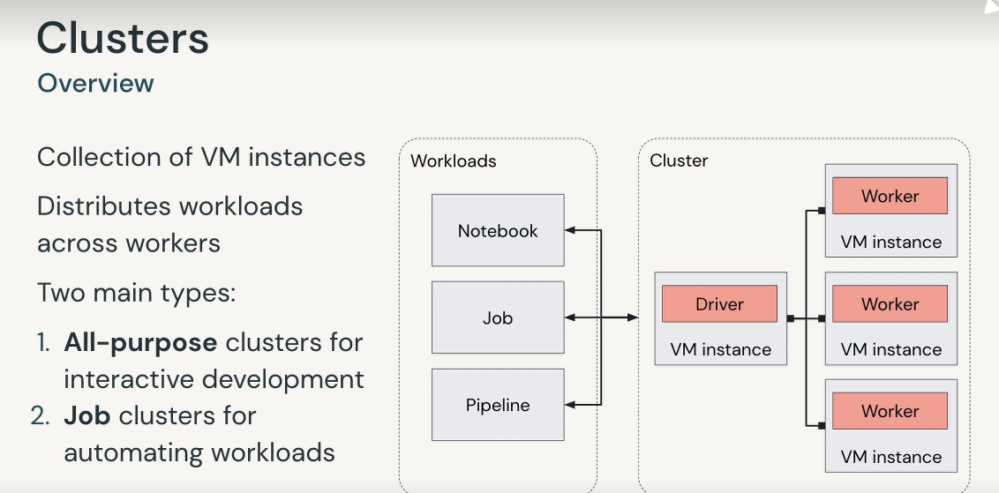
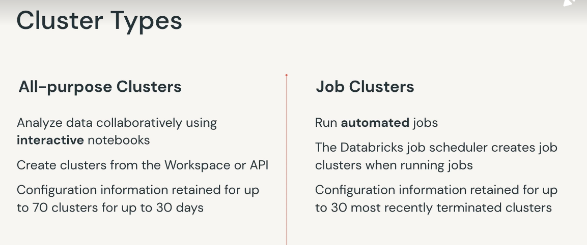
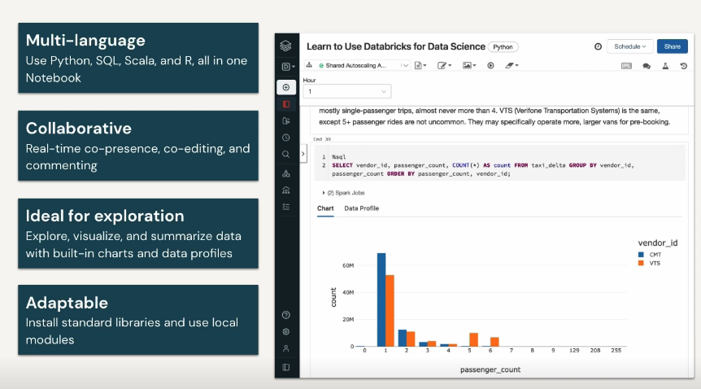
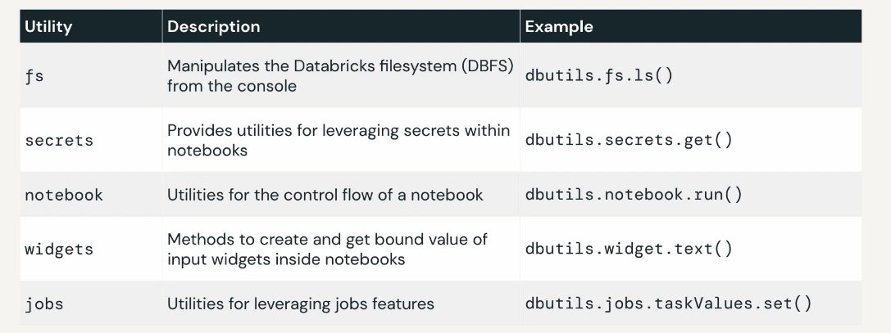
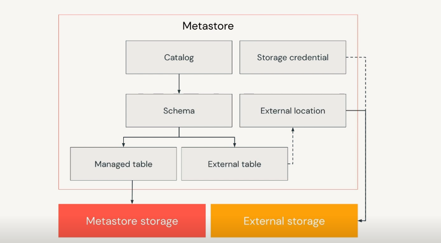

# Databricks

## Databricks Lakehouse Fundamentals


### What is a Data Warehouse?

- Data Warehouse unlike relational databases provided Business Intelligence, analytics and pre defined schema logic.
- They were not designed for semi and unstructured data. They can't handle upticks in volume and velocity and had long processing times.

### Data lakes
 
 - Data Lakes had flexible data storage capabilities, streaming support and AI ML capabilities.
- But it introduced concerns and are not supported for transactional data. There is no data reliability and data governance is still a concern.

Hence businesses required two different data platforms. 

- The data warehouse had structured tables for BI and SQL Analytics, whereas data lakes had unstructured data for Data Science and Data Streaming.
- They also had different governance and security models and most important there were two separate copies of data.

#### How does the Lakehouse Solve this Problem?

- It can serve all ML, SQL and BI, streaming use cases.
- One security and governance approach for all data assets on cloud.
- An open and reliable data platform to efficiently handle all data types.

#### Key Features

- Transaction Support
- Schema Enforcement and Governance 
- BI Support 
- Data Governance
- Decoupled Storage from Compute and Separate Clusters.
- Support for Diverse data workload in the same data repository.

#### Problems with Data Lake

- Lack of ACID Transaction support
- Lack of Schema Enforcement
- Lack of Integration with Data Catalog

#### Delta Lake

- File based open data format that provides ACID transaction guarantees. We can handle metadata for petabytes of data.
- Audit history and time travel capabilities.
- Schema Enforcement ensures there is no wrong data that is in the tables and schema evolution to accommodate ever changing data.
- Supports Change Data Capture, Slowly Changing Dimensions and  Streaming Upserts.
- Delta Tables are based on Apache Parquet, common format for structuring data.
- It has a transaction log and acts as a single source of truth.

#### Photon

- Next Gen query engine that saves costs, its compatible with Spark APIs. Loading and querying data becomes increasingly faster.
- Each Spark Executor can have a photon engine that accelerates portion of spark and sql queries.

### Why is a Unified governance and security model structure important?

The more individual access points added to the system like users, groups or external connectors, the higher the risk of data breaches.

Some challenges are diversity of data assets, using two incompatible platforms and fragmented tool usage.

Databricks overcomes these challenges by using Unity Catalog for Data Governance, delta sharing to share data across any computing platform.

Unlike a few years back when each workspace/team had different Access Controls, User Management and Metastores, with Unity Catalog we can have centralized access controls and user management, including row and column level access permission privileges.

We can control access to multiple data items at one time eg. personal info can be tagged and a single rule can be defined to provide access as needed.

Unity provides highly detailed audit trails that define who has accessed what data at what time and also highlights the changes made.

Data Lineage is provided by Unity Catalog and it includes the history of data, what datasets it came from, who created it and when + the transformations performed on it.

### Data Sharing With Delta Sharing

Usually the data is shared as tables and not files. So this system is not scalable.

We cannot share data across platforms using traditional technology.

Delta Sharing allows the data to be moved to any cloud platform securely.

**Advantages**

- No new ingestion processes needed to share data and integrates with PowerBI, Tableau, Spark and Pandas.
- Data is shared live without copying it.
- Centralized Admin and Governance.
- The data products can be built and packaged via a central marketplace.
- There are privacy safe clean rooms to secure data and collaboration between vendors. 

### Divided Security Architecture

#### Control Plane
- Consists of managed backend services that Databricks provides.
- These live in Databricks own cloud account.
- It runs the web application and manages the notebooks, applications and clusters.

#### Data Plane

Data plane is where the data is computed. Unless we use serverless compute, the clusters run in the business owner's own cloud account.

The information in the control plane is encrypted at rest and in transit.

Databricks clusters are shortlived and do not persist after job termination.

If there are any security issues coming up, the service request can be generated and the Databricks employees are given access to the workspace for a certain duration of time.

### User Access and Identity

- Table ACL feature
- IAM Instance Profiles
- Securely Store access keys
- The Secrets API

### Instant Compute and Serverless

In normal scenario, we run clusters on the dataplane that's connected to an external storage.

But some challenges with this are that:

- Cluster Creation is complicated.
- Environment Setup is slow
- Capacity and costs of the business cloud account should be managed.

In Serverless Compute, Databricks allows us to run the clusters on their cloud account instead of the business.

The environment starts immediately and can scale in seconds.

These servers are unassigned to any user, always in a warm state and waiting to run jobs given by the users.

The three layers of isolation in the container that is hosting the runtime, virtual machine hosting the container and the virtual network for the workspace.

Each of the parts is isolated with no sharing or cross network traffic allowed.

Once the job is done, the VM is terminated and not used again for other compute tasks.

### Common Data Lakehouse Terminology 

#### Unity Catalog Components

1. Metastore: Top level logical container in Unity Catalog. It's a construct that represents the metadata. They offer improved security and other useful features like auditing.
2. Catalog : Top most container for data objects in Unity Catalog. Data Analysts use this to reference data objects in UC.

There are three main namespaces to address the data location names in UC. The format is ```SELECT * FROM catalog.schema.table```

3. Schema : Contains tables and views and is unchanged by UC. Forms the second part of the three level namespace. Catalogs can contain many schemas as desired.

4. Tables : SQL relations with ordered list of columns. They have metadata like comments, tags and list of columns.

5. Views : They are stored queries that are executed when we query the view. They are read only.

Other components are Storage Credentials created by admins and used to authenticate with cloud storage containers.

Shares and recipients is related to delta sharing for low overhead sharing over different channels inside or outside organization by linking metastores in different parts of the world. 

The metastore is essentially a logical construct with Control Plane and Cloud Storage.

The metadata information about the data objects and the ACLs are stored in control plane and data related to objects maintained by the metastore is stored in cloud storage.

### Challenges in Data Engineering Workload

- Complex Data Ingestion Methods
- Support For data engineering principles
- Third Party Orchestration Tools
- Pipeline Performance Tuning
- Inconsistencies between partners.

The Databricks Lakehouse platform provides us with managed data ingestion, schema detection, enforcement and evaluation along with declarative and auto scaling data flow with a native orchestrator.

 #### Capabilities of DE in Lake House
- easy data ingestion
- auto etl pipelines
- data quality checks
- batch and stream tuning

#### Autoloader 

As data loads in the lakehouse, Databricks can infer the schema after processing the data as they arrive in the cloud storage.

It auto detects the schema and enforces it guaranteeing data quality.

The ```COPY INTO``` command is used by data analysts to load data from a folder to the Delta Lake Table.

### Delta Live Tables

ETL framework that uses a simple declarative approach to build reliable pipelines and automatically auto scales the infra so that data folks can spend less time on tooling and get value from data.

- We can declaratively express entire data flows in Python.
- Natively enable software engineering best practices such as separate dev and prod environments and test before deployment in a single API.

### Workflows

Orchestration service embedded in Databricks Lakehouse platform. Allow data teams to build reliable data workflows on any cloud.

We can orchestrate pipelines written in DLT or dbt, ML pipelines etc.

We can use external tools like Apache Airflow to manage the workflows or even use the API.

One example of delta live tables pipeline is using Twitter Stream API to retrieve live tweets to S3, then use delta live tables to ingest, clean and transform tweets and finally do sentiment analysis.

## Credential


## Databricks Academy : Data Engineer Learning Plan


Link to the course : [click here](https://customer-academy.databricks.com/learn/lp/10/Data%2520Engineer%2520Learning%2520Plan)

### Course 1 : Data Engineering with Databricks

#### Goals

- Use the Databricks Data Science and Engineering Workspace to perform common code development tasks in a data engineering workflow.

- Use Spark SQL/PySpark to extract data from a variety of sources, apply common cleaning transformations, and manipulate complex data with advanced functions.

- Define and schedule data pipelines that incrementally ingest and process data through multiple tables in the lakehouse using Delta Live Tables in Spark SQL/PySpark. 

- Create and manage Databricks jobs with multiple tasks to orchestrate and monitor data workflows.
Configure permissions in Unity Catalog to ensure that users have proper access to databases for analytics and dashboarding.

#### Getting Started With the Workspace


**Architecture and Services**


- The data plane has the compute resources and clusters that is connected to a cloud storage. It can be single or multiple cloud storage accounts.

- The Control Plane stores the UI, notebooks and jobs and gives the ability to manage clusters and interact with table metadata.

- Workflow manager allows us to manage tasks and pipelines.

- Unity Catalog mostly provides with Data Lineage, Data Quality and Data Discovery

- There are three personas that Databricks provides : Data Science and Engineering Persona, ML Persona and SQL Analyst Persona

- Cluster is a set of computational resources where workloads can be run as notebooks or jobs.

- The clusters live in the data plane in the org cloud account but cluster mgmt is fn of control plane.

#### Compute Resources

##### Overview


##### Cluster Types


- Job Clusters cannot be restarted if terminated.
- All purpose clusters can be started whenever we want it to.

##### Cluster Mode


##### Databricks Runtime Version


##### Access Mode

Specifies overall security model of the cluster.


- DBFS mounts are supported by single user clusters.

##### Cluster Policies


##### Access Control Matrix


- On shared security mode multiple users can be granted access.

##### Why Use Databricks Notebooks?



##### Databricks Utilities


##### Databricks Repos


Some supported operations include:

- Cloning a repository, pulling and upstream changes.
- Adding new items, creating new files, committing and pushing.
- Creating a new branch.
- Any changes that are made in a Databricks Repo can be tracked in a Git Repo

#### Transform Data With Spark

##### Data Objects in the Lakehouse


- Catalog - Grouping of Databases
- Schema - Grouping of Objects in catalog
- Every schema has a table that is managed or external

##### Managed vs External Storage


- View is a saved query against one or more databass. Can be temporary or global. Temp Views are scoped only to the current spark session

- CTE's only alias the results of the query while that query is being planned or executed

#### Providing Options When Dealing with External Data Sources

**Creating a table using SQL DDL and Providing Options**

```sql
CREATE TABLE IF NOT EXISTS sales_csv
    (order_id LONG,email STRING,timestamp LONG,total_item_quantity INTEGER,items STRING)
USING CSV
OPTIONS (
    header = 'true'
    delimiter = "|"
)
LOCATION "${paths.dba_sales.csv}"
```

#### Limits of Tables with External Data Sources

- When we are using external data sources other than Delta Lake and Data Lakehouse we can't expect the performance to be good always.
- Delta Lake will always guarantee that we get the most recent data from the storage.
- When we add data to a table/csv that is already in the database, use the ```REFRESH TABLE table_name``` command to update the cache and make sure that the most recent data is in the data storage.
- Note that refreshing the table will invalidate out cache so it needs to be rescanned again. 

#### Using JDBC to extract data from SQL Databases

```sql
DROP TABLE IF EXISTS users_jdbc

CREATE TABLE users_jdbc
USING jdbc
OPTIONS (
	url = "jdbc:sqllite:paths.ecommerce_db",
	dtable = 'users'
)
```	

**Checking if there are any files in the JDBC**

```sql
%python
import python.sql.functions as F

location = spark.sql("DESCRIBE EXTENDED users_jdbc").filter(F.col("col_name") == "Location").first["data_type"]
print(location)

files = db.fs.ls(location)
print(f"Found {len(files)} files"
```

#### How does Spark Interact with External Databases

- Move the entire database to Databricks and then execute logic on the currently active cluster.
- Pushing the query to an external database and only transfer results back to Databricks.

### Cleaning Data using Spark

```sql
SELECT count(*), count(user_id),count(user_first_timestamp)
FROM users_dirty
```
We can observe that some data is missing.

```sql
SELECT COUNT(*) FROM users_dirty 
WHERE email IS NULL
```
#### Deduplicating the Rows Based on Specific Columns

- Use max to keep the values of ```email``` and updated in the result of ```group_by```
- Capture non null emails when there are multiple records.
- We know that for each user there will be a unique tuple of ```email```, ```timestamp``` and other columns.

```sql
CREATE OR REPLACE TEMP VIEW deduplicated AS
SELECT user_id,user_timestamp, max(email) AS email, max(updated) AS updated
FROM users_dirty
WHERE user_id IS NOT NULL
GROUP BY user_id,user_first_touch_timestamp;
``` 

#### Validating Duplicates

```sql
SELECT max(row_count) <= 1 AS no_of_duplicate_ids FROM(
	SELECT user_id, count(*) AS row_count
	FROM deduped_users
	GROUP BY user_id
)
```

Checking if each user has at most one email id

```sql
SELECT max(row_count) <= 1 no_of_duplicate_email FROM (
	SELECT email,COUNT(user_id) AS user_id_count
	FROM deduped_users
	WHERE email IS NOT NULL 
	GROUP BY email
)
```

**TASK**

- Correctly scale and cast the ```user_first_touch_timestamp```
- Extract the calendar date and time in a human readable format
- Use ```regexp_extract``` to fetch the email domains

```sql
SELECT *,
	date_format(first_touch,"MM DD,YYYY",first_touch_date),
	date_format(first_touch,"HH:mm:ss",first_touch_time),
	regexp_extract(email,"?<=@.+") AS email_domain
FROM (
	SELECT *,
		CAST(user_first_touch_timestamp/1e6 AS time_stamp) AS first_touch
	FROM deduped_users
)
```

[Why divide by 1e6 to convert timestamp to a date?](https://stackoverflow.com/questions/65124408/pyspark-convert-bigint-to-timestamp-with-microseconds#:~:text=Divide%20your%20timestamp%20by%201e6,units%20of%20second%2C%20not%20microsecond.)

#### Complex Transformations on JSON data

```python
from pyspark.sql.functions import col

events_trigger_df = (spark
	.table("events_raw"),
	.select(col("key").cast("string"),
			col("value").cast("string"))
)
display(events_trigger_df)
```
The value column in the events data is nested.

**Task: Check where the event name is finalized**

```python
display(events_string_df
	.where("value:event_name = 'finalize'")
	.orderBy("key")
	.limit(1)
)
```

**Extracting the schema of the JSON**

```sql
SELECT schema_of_json("some_json") AS schema
```

**Task: Convert the JSON data to table/view**

```sql
CREATE OR REPLACE TEMP VIEW parsed_events AS SELECT json.* FROM
(
	SELECT from_json(value, '<the schema>') AS json
	FROM event_strings
) 
```
```sql
SELECT * FROM parsed_events;
```

Some more code examples for ```from_json```

```python
#Convert JSON string column to Map type
from pyspark.sql.types import MapType,StringType
from pyspark.sql.functions import from_json
df2=df.withColumn("value",from_json(df.value,MapType(StringType(),StringType())))
df2.printSchema()
df2.show(truncate=False)
```
Docs for [Map Type](https://spark.apache.org/docs/3.1.1/api/python/reference/api/pyspark.sql.types.MapType.html)

Docs for [from_json](https://spark.apache.org/docs/3.1.1/api/python/reference/api/pyspark.sql.functions.from_json.html)

#### Array Manipulation Functions

- ```explodes()``` separates the elements of the array into different rows and creates a new row for each element.
```sql
CREATE OR REPLACE TEMP VIEW exploded_events AS
SELECT *, explode(items) AS item
FROM parsed_events
```

```sql
SELECT * FROM exploded_events WHERE SIZE(items) > 2
```
Each element of the items column which is in json format is now in a separate row.

#### Complex Array Manipulation Functions

```collect_set``` collects unique values for a field including those within arrays also.

```flatten()``` combines various values from multiple arrays in a single array.

```array_distinct()``` removes duplicate values from the array.

**Task: Pull out cart history details from the events table**

```SQL
SELECT user_id,
	   collect_set(event_name) AS event_history,
	   array_distince(flatten(collect_set(items.item_id))) AS cart_history
FROM exploded_events
GROUP BY user_id
```

#### SQL UDF Functions

Here is a Jupyter [notebook](https://www.databricks.com/wp-content/uploads/notebooks/sql-user-defined-functions.html) with all the common SQL UDF Functions.

**Sample Scripts**

1. Simple Concat Function 
```sql
CREATE OR REPLACE FUNCTION sales_announcement(item_name STRING,item_price INT)
RETURN STRING
RETURN concat("The ",item_name,"is on sale for $",round(item_price*0.8,0))
```
SQL UDF's are part of the metastore.

The ```DESCRIBE FUNCTION EXTENDED <table_name>``` gives basic info about expected inputs and basic information.

```BODY``` field has the function description of the SQL logic used in the function itself.

2. Case When Function

```sql
  SELECT *, yrs_to_mat,
     CASE 
          WHEN X < 3 THEN "under3"
          WHEN X => 3 AND < 5 THEN "3to5"
          WHEN X => 5 AND < 10 THEN "5to10"
          WHEN X => 10 AND < 15 THEN "10to15"
          WHEN X => 15 THEN "over15"
          ELSE null END AS maturity_bucket
    FROM matyrs;
```
#### Python UDFs

- The custom transformation operation cannot be 	optimized by a Catalyst Analyzer.

- The function is serialized and sent to the executors.

- Row data is deserialized from Spark's native format to pass to the UDF, and the results are serialized back to the Spark native format.

**Define a Function**

```python
def first_letter_function(email):
	return email[0]
```

**Create User Defined Function**

- First serialize the function and then send it to the executors to be applied to the DataFrame records.

```python
first_letter_udf = udf(first_letter_function)
```

**Apply the UDF on the email column**

```python
from pyspark.sql.functions import col
display(sales_df.select(first_letter_udf(col("email"))))
```
**Register UDF to be used in SQL**

```python
sales_df.createOrReplaceTempView("sales")
first_letter_udf = spark.udf.register("sql_udf",fist_letter_function)
```

**Use it in SQL**

```sql
SELECT sql_udf(email) AS first_letter FROM sales
```

**Using Decorator Syntax**

```python
@udf("string")
def first_letter_udf(str):
return email[0]
```

#### Normal Python UDFs vs Pandas UDFs

Normal Python UDF
```python
from pyspark.sql.functions import udf

# Use udf to define a row-at-a-time udf
@udf('double')
# Input/output are both a single double value
def plus_one(v):
      return v + 1

df.withColumn('v2', plus_one(df.v))
```
Pandas UDFs : Row at a time

```python
from pyspark.sql.functions import pandas_udf, PandasUDFType
@pandas_udf('double', PandasUDFType.SCALAR)
def pandas_plus_one(v):
    return v + 1
df.withColumn('v2', pandas_plus_one(df.v))
```

In the row-at-a-time version, the user-defined function takes a double "v" and returns the result of "v + 1" as a double. In the Pandas version, the user-defined function takes a  `pandas.Series`  "v" and returns the result of "v + 1" as a  `pandas.Series`. Because "v + 1" is vectorized on  `pandas.Series`, the Pandas version is much faster than the row-at-a-time version.

### Managing Data with Delta Lake 

Delta Lake enables building a data lakehouse on top of the existing cloud storage. Its not a database service or data warehouse.

It's built for scalable metadata handling.

Delta Lake brings ACID transaction guarantees to object storage.

#### Problems Solved by ACID

- Hard to append data
- Modification of existing data is difficult
- Jobs fail mid way
- Costly to keep historical data versions.

#### Schemas and Tables

Two ways to create schemas:

1. One with no location provided
2. One with location specified.

```sql
CREATE SCHEMA IF NOT EXISTS ${da.schema_name}_default_location
```

```sql
CREATE SCHEMA IF NOT EXISTS ${da.schema_name}_custom_location LOCATION 
'${da.paths.working_dir}/${da.schema_name}_custom_location_db'
```

The description of both the schemas will have the database name, catalog name, location and owner.

What happens if we drop the table?

```sql
DROP TABLE managed_table_default_location
``` 
The data and log files are deleted. Only the schema directory remains.

#### Creating External Tables

```sql
USE ${da.schema_name}_default_location;

CREATE OR REPLACE TEMPORARY VIEW temp_delays 
USING CSV OPTIONS (
	path = "${da.paths.datasets}/flights/delay_departures.csv",
	header = "true",
	mode = "FAILFAST"
);

CREATE OR REPLACE EXTERNAL TABLE external_table LOCATION '${da.path.working_dir}/external_table' AS 
	SELECT * FROM temp_delays;

SELECT * FROM external_table
```

Dropping the external table deletes the table definition but the data is still there.

To drop external table schema use : 

```sql
DROP SCHEMA {da.schema_name}_custom_location CASCADE;
```
