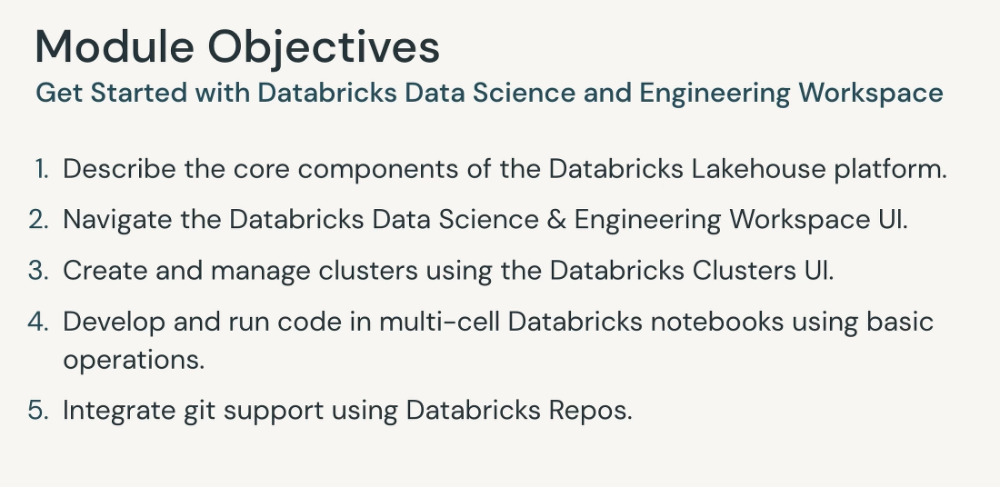
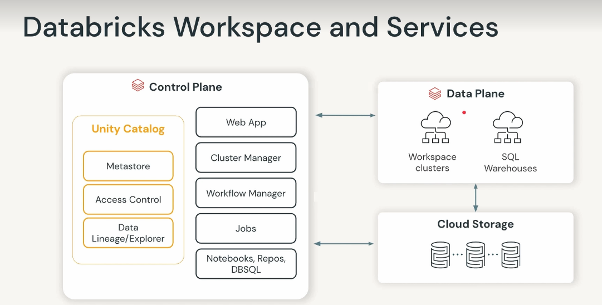
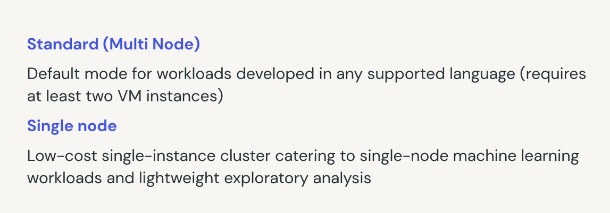
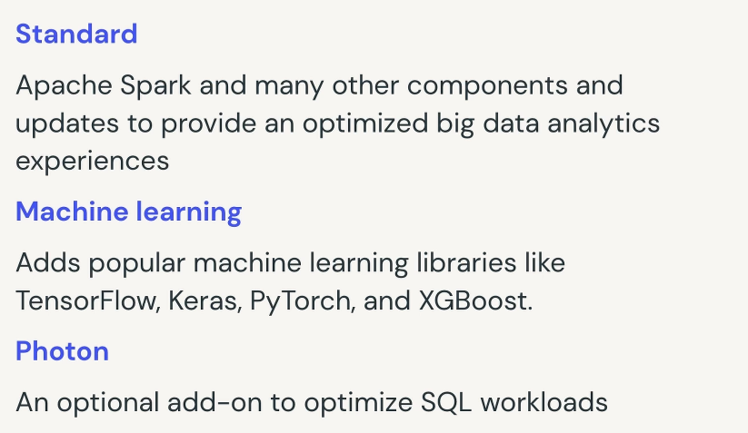
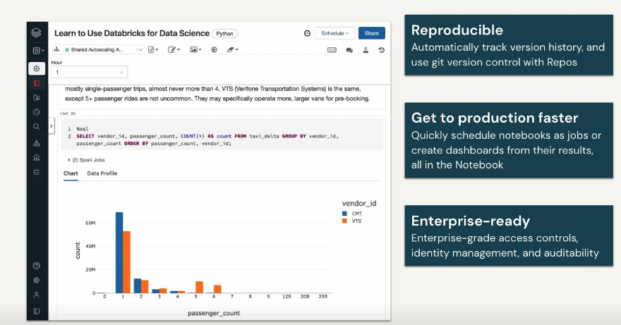
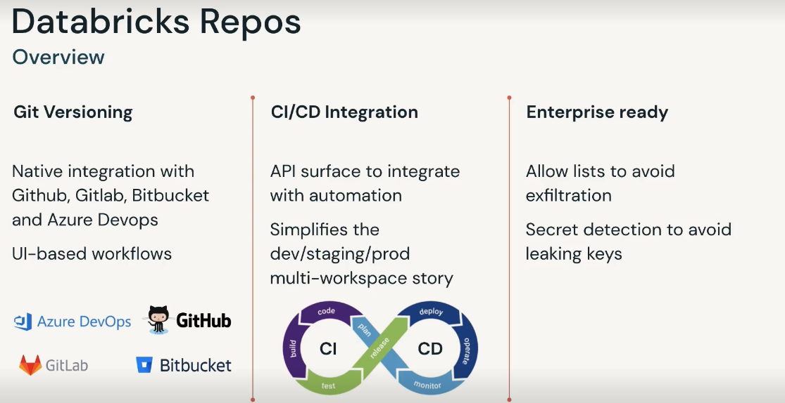

# Databricks

## Databricks Academy : Data Engineer Learning Plan


Link to the course : [click here](https://customer-academy.databricks.com/learn/lp/10/Data%2520Engineer%2520Learning%2520Plan)

### Course 1 : Data Engineering with Databricks

#### Goals

- Use the Databricks Data Science and Engineering Workspace to perform common code development tasks in a data engineering workflow.

- Use Spark SQL/PySpark to extract data from a variety of sources, apply common cleaning transformations, and manipulate complex data with advanced functions.

- Define and schedule data pipelines that incrementally ingest and process data through multiple tables in the lakehouse using Delta Live Tables in Spark SQL/PySpark. 

- Create and manage Databricks jobs with multiple tasks to orchestrate and monitor data workflows.
Configure permissions in Unity Catalog to ensure that users have proper access to databases for analytics and dashboarding.

#### Getting Started With the Workspace



**Architecture and Services**



- The data plane has the compute resources and clusters that is connected to a cloud storage. It can be single or multiple cloud storage accounts.

- The Control Plane stores the UI, notebooks and jobs and gives the ability to manage clusters and interact with table metadata.

- Workflow manager allows us to manage tasks and pipelines.

- Unity Catalog mostly provides with Data Lineage, Data Quality and Data Discovery

- There are three personas that Databricks provides : Data Science and Engineering Persona, ML Persona and SQL Analyst Persona

- Cluster is a set of computational resources where workloads can be run as notebooks or jobs.

- The clusters live in the data plane in the org cloud account but cluster mgmt is fn of control plane.

#### Compute Resources

##### Overview


##### Cluster Types


- Job Clusters cannot be restarted if terminated.
- All purpose clusters can be started whenever we want it to.

##### Cluster Mode


##### Databricks Runtime Version


##### Access Mode

Specifies overall security model of the cluster.


- DBFS mounts are supported by single user clusters.

##### Cluster Policies


##### Access Control Matrix


- On shared security mode multiple users can be granted access.

##### Why Use Databricks Notebooks?




##### Databricks Utilities


##### Databricks Repos


Some supported operations include:

- Cloning a repository, pulling and upstream changes.
- Adding new items, creating new files, committing and pushing.
- Creating a new branch.
- Any changes that are made in a Databricks Repo can be tracked in a Git Repo

#### Transform Data With Spark

##### Data Objects in the Lakehouse


- Catalog - Grouping of Databases
- Schema - Grouping of Objects in catalog
- Every schema has a table that is managed or external

##### Managed vs External Storage


- View is a saved query against one or more databass. Can be temporary or global. Temp Views are scoped only to the current spark session

- CTE's only alias the results of the query while that query is being planned or executed

#### Providing Options When Dealing with External Data Sources

**Creating a table using SQL DDL and Providing Options**

```sql
CREATE TABLE IF NOT EXISTS sales_csv
    (order_id LONG,email STRING,timestamp LONG,total_item_quantity INTEGER,items STRING)
USING CSV
OPTIONS (
    header = 'true'
    delimiter = "|"
)
LOCATION "${paths.dba_sales.csv}"
```

**Limits of Tables With External Data Sources**

